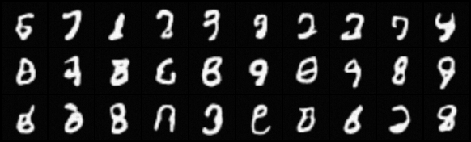

# glow-pytorch
PyTorch implementation of Glow with mnist dataset   
Generative Flow with Invertible 1x1 Convolutions (https://arxiv.org/abs/1807.03039)   
Usage:
> python train.py PATH

Sample:

Better handwriting generation model is on the way...
